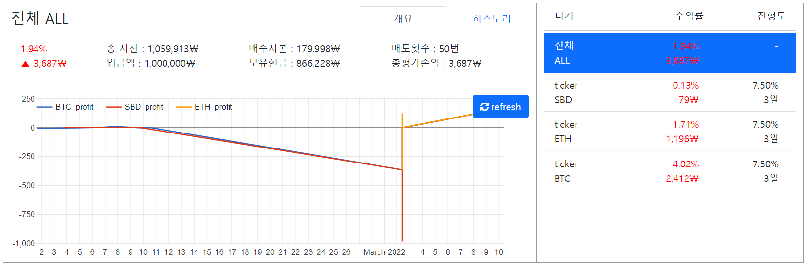

# Muhan Maesu V2
코인에 무한매수법을 자동화해서 적용시켜보자  
토큰을 잘못 올려서 레포를 다시 생성했습니다(내 모내기...😥)  
무한매수 기술블로그를 개설했습니다! 무한매수 서비스의 개발 현황을 자세히 확인하실 수 있습니다.  
기술블로그 >> [https://casselkim.notion.site/56a076ed685644fa9d0d83007d7709b0](https://casselkim.notion.site/56a076ed685644fa9d0d83007d7709b0)  

## Introduction
Let's automate **infinite buy** method that popular these days  

  

## Requirements
- requests
- pyupbit
- django
- celery
- rabbitMQ
- docker

## Use  
Manage application by admin page -> No Domain yet
(Considering conversion of architecture from EC2 to Mobile app (Flutter))  

## Update
- now multiple coins can be used at the same time  
  1. by adding an information of ticker, principal, and first buy to 'order.json'  
  2. by writting down and information of ticker, principal, and first buy on the shell 
- now state update execute every second (2021-01-04)
- now you can make order.json by using `order.py` (2021-01-05)
- now you can set environments by using `requirements.sh` (2021-01-06)  
- now you can make secret.json by using `secret.py` (2021-01-06)
- now you can access Django page by using `python runserver` on local environments (2021-02-03)  

## Now working..
1. make amazon linux 2 (CentOS) instance (EC2)
2. install docker and deploy the project on container
3. make project to docker image, upload on docker hub
4. build image on docker of local environment, continue development with docker and k8s. (Scheduling sync and buy(sell) job with celery and rabbitMQ)

  
