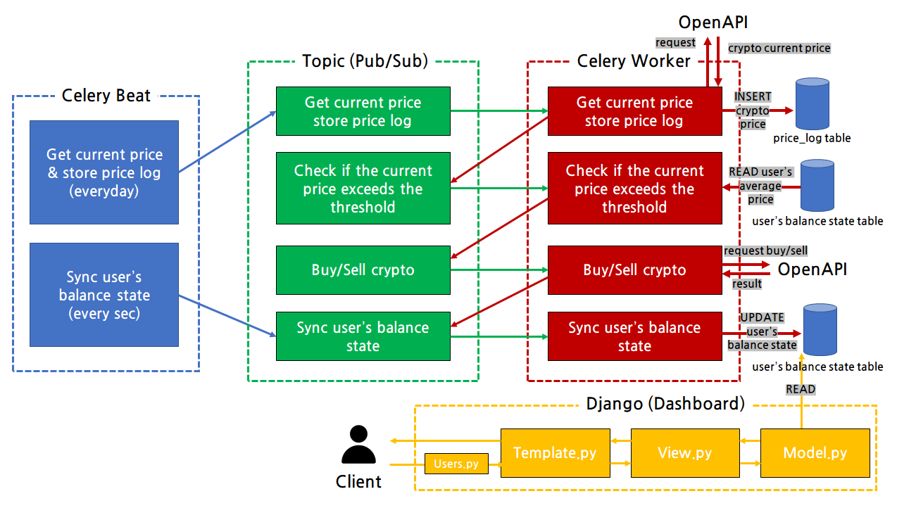

# Muhan Maesu V3
  
리팩토링 진행중입니다
- 디자인 패턴 적용
- 비동기 프로세스
- 파이썬 코드 클리닝 작업

---

무한매수 기술블로그를 개설했습니다! 무한매수 서비스의 개발 현황을 자세히 확인하실 수 있습니다.  
기술블로그 >> [https://casselkim.notion.site/56a076ed685644fa9d0d83007d7709b0](https://casselkim.notion.site/56a076ed685644fa9d0d83007d7709b0)  

## Introduction
Let's automate **infinite buy** method that popular these days  3
  

## Requirements
- requests
- pyupbit
- django
- docker

## Use  
Manage application by admin page -> No Domain yet
(Considering conversion of architecture from EC2 to Mobile app (Flutter))  

## Update
- now multiple coins can be used at the same time  
  1. by adding an information of ticker, principal, and first buy to 'order.json'  
  2. by writting down and information of ticker, principal, and first buy on the shell 
- now state update execute every second (2021-01-04)
- now you can make order.json by using `order.py` (2021-01-05)
- now you can set environments by using `requirements.sh` (2021-01-06)  
- now you can make secret.json by using `secret.py` (2021-01-06)
- now you can access Django page by using `python runserver` on local environments (2021-02-03)  

## Now working..
refactoring prject
- using MVT pattern
- re-design architecture
- rewrite tech-blog
